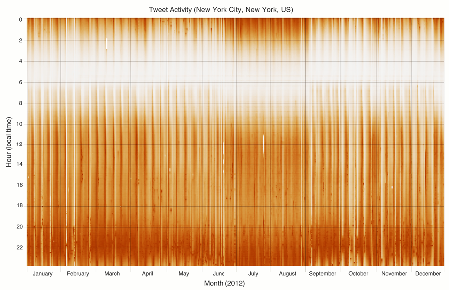
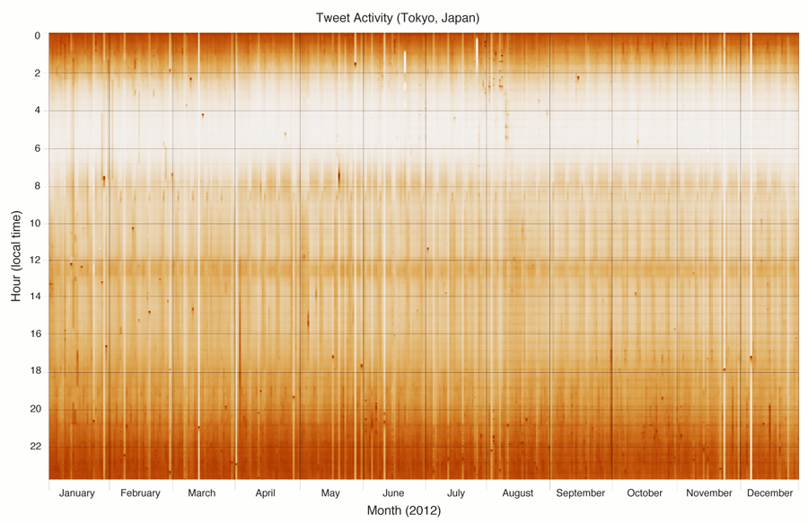
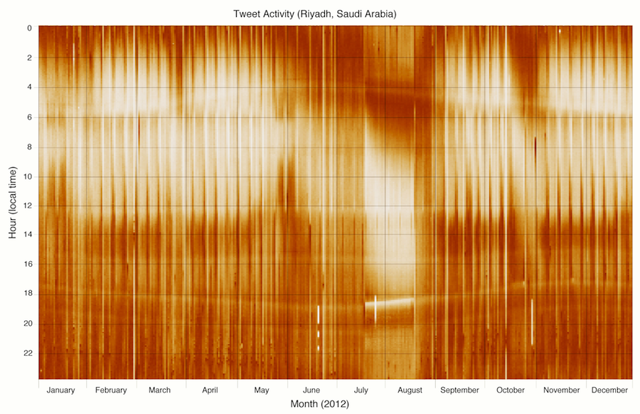
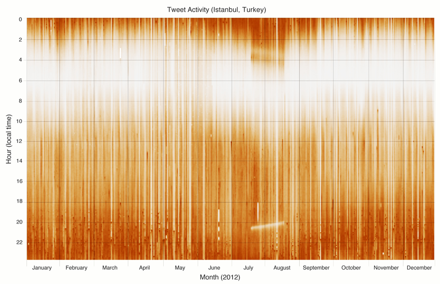
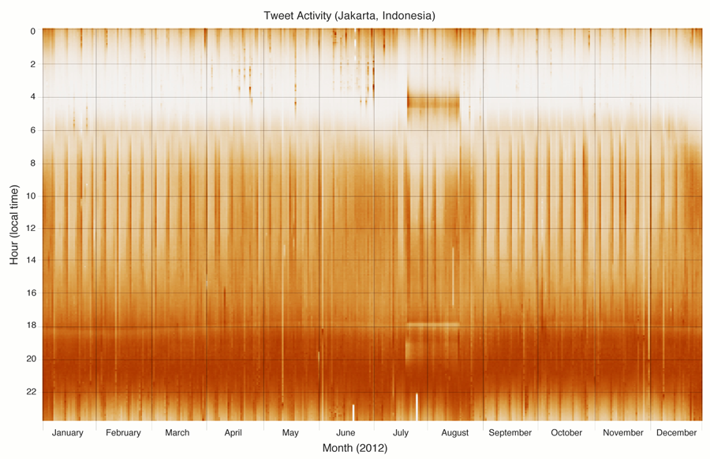
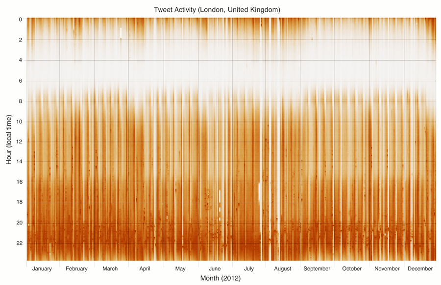
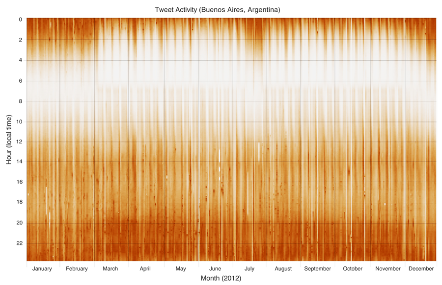
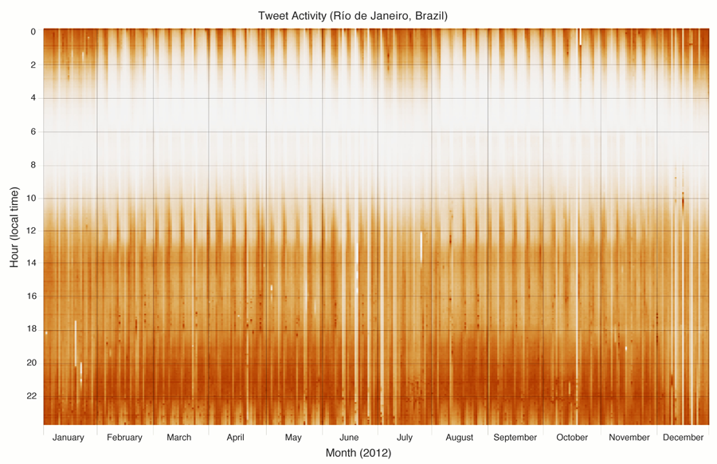

> We present a large-scale analysis of activity on Twitter in 50 major cities around the world throughout all of 2012. Our study consists of two parts: First, we created heatmap visualizations, through which periods of comparatively intense and sparse activity are readily apparent—these visual patterns reflect diurnal cycles, cultural norms, and even religious practices. Second, we performed a cluster analysis of these activity patterns to identify groupings of cities that are similar in the ways their inhabitants use Twitter. Not surprisingly, cities cluster geographically, although we are able to identify cross-cultural similarities as well.

Introduction
============

Twitter has become an indispensable communications platform through which hundreds of millions of users around the world keep up with breaking news, share their thoughts, and connect with like-minded individuals, 140 characters at a time. Aggregate patterns of user behavior on Twitter tell us a lot about the “pulse” of the global conversation. In this paper, we present a case study examining tweet creation activity for 50 cities around the world throughout all of 2012. The analysis proceeds in two parts: First, we created heatmap visualizations that show the intensity of Twitter activity in terms of time of day and day of year. From these visualizations, the “rhythm” of activities in major cities becomes apparent: we see diurnal cycles of waking and sleeping, weekly cycles of work and play, large seasonal shifts in behavior, and even activity patterns that stem from religious practices. Not surprisingly, we see large differences in these patterns in different parts of the world, reflecting cultural differences and the myriad ways that Twitter is used. In the second part of our analysis, we treated these activity patterns as “fingerprints” of each city and performed a clustering analysis to quantify the similarities between individual cities and groups of cities; these results are visualized in a dendrogram.

There are two reasons for presenting this work. First, we believe that our results are intrinsically interesting, and we have not seen large-scale analyses along these lines before. Such analyses are very difficult to accomplish without access to all the data, since any sampled stream becomes too sparse when focusing only on specific geographic locations. In contrast, we have access to all tweets, and thus we are confident that our findings are not artifacts introduced by data sampling. Second, this work presents a case study illustrating the role of visualization in data science. “Big data” and data science have gained prominence in both industry and academia, but most of the discussion revolves around efficient algorithms for analyzing terabytes to petabytes of data—for example, better join algorithms. We feel that visualization deserves a more prominent role in the discourse—after all, analyses on big data must eventually be presented to humans for interpretation. Our case study serves as an example of transforming terabytes on disk to pixels on screen.

The Role of Visualizations
==========================

Let us first elaborate on the second point, the role of visualizations in data science. Ultimately, the data scientist’s job is to analyze massive amounts of data, interpret “what the data say”, and distill the bits into *actionable* insights:  what web site elements to refine, what features to develop, what markets to pursue, etc. To accomplish this, data visualization is an indispensable tool. At a mundane level, this involves dashboards to enable stakeholders to browse through large amounts of multi-dimensional data, including interactive “drill downs” and “roll ups”, overlaid with projections and other derived data.

Beyond simple dashboards, data scientists often build one-off visualizations that are the result of a specific task, usually a business question. For example, in 2010 when Twitter was outgrowing its datacenter footprint, we created a custom visualization that let engineers interactively examine server utilization statistics along with network bandwidth usage in order to better optimize resource allocation.

Finally, we occasionally produce visualizations intended for public consumption, which are presented on Twitter’s blog. These are less intended to generate insights for the business; rather, their primary purpose is to highlight the “pulse” of the global conversation on Twitter, often in reaction to major news events around the world.

Our study serves a combination of the second and third purposes. User growth is an important priority for Twitter, and understanding patterns of activity is a pre-requisite to facilitating growth. The visualizations and analyses we present here were part of efforts to better understand how Twitter users behave in different parts of the world. Along the way, we discovered that many of our findings were intrinsically interesting, and thus we have taken the additional step of sharing our results with the community.

[p]         [viz:cities]

[t]  [viz:dendrogram]

Data Preparation and Analysis
=============================

Data preparation consisted of analyzing all public tweets posted in 2012 in our Hadoop-based data warehouse using Pig . A more detailed description of Twitter’s analytics infrastructure can be found in . Our analysis focused on the top 50 cities in terms of Twitter users. We divided each day into 10 minute chunks and computed the number of tweets that were posted during each interval as a way of quantifying activity. The values were normalized between zero and one on a *per day* basis. This is an important design decision because the total number of tweets changes day to day and grows over time, but this treatment also results in a few artifacts in the visualizations, as we shall discuss. For each city, this gives us \(365 \times 24 \times 6 = 53560\) data points.

City by City Observations
=========================

Figure [viz:cities] shows heatmap visualizations for eight of the fifty cities that we examined. The *x*-axes show day of year, and *y*-axes show time of day (local time); darker shading indicates higher levels of activity. We examine each panel in turn:

What immediately jumps out are the vertical stripe patterns which correspond to weekly cycles of activity. Focusing on the morning hours, the pattern consists of a wide region of comparatively darker shading followed by a narrow region of lighter shading. This corresponds to users getting up earlier during weekdays and later on weekends. The pattern changes later in the day: we see a wide region of comparatively lighter shading followed by a narrower region of darker shading. This is explained by users tweeting less during work hours and comparatively more during the same period of time on the weekends. Overall, Twitter activity is highest in the evenings (both weekdays and weekends), and activity extends past midnight on weekends.

In addition to the weekly cycles, we observe a large seasonal shift. This corresponds to the school calendar: for public schools, the final day of classes in the 2011–2012 school year was June 27, 2012, and the first day of classes in the 2012–2013 school year was September 6, 2012. The period of time in between marks summer vacation for school children and explains why we observe more activity past midnight and less activity in the morning.

The white empty space on March 11 corresponds to the beginning of daylight saving time. Since all timestamps have been translated to local time, that hour never “existed”, since in the United States users adjust their clocks to skip an hour. Note that there is no corresponding artifact in November when daylight saving time ends—in terms of local time, that hour “repeats”, and we simply take the average of both intervals. The other artifacts in the heatmap on June 21 and July 26 correspond to Twitter outages—they are present in the other panels as well, but occur at different local times.

Patterns of activity in Tokyo appear very different from those in New York City. Although we still see the striping pattern corresponding to weekly cycles, the contrast is far lower. Compared to New York, users in Tokyo exhibit far less variation in activity between weekends and weekdays. It appears that users mostly tweet in the evening, with pockets of activity in the morning and around noon (except on weekends). Also, we do not see any major seasonal shifts. Overall, user behavior is remarkably consistent all year-round.

In many ways, this was the most surprising visualization of all the cities we looked at—so much so that initially we thought there were data errors. In the heatmap, we see five distinct bands: the top is convex in shape with a peak in late June, the next two are mostly flat, and the bottom two are concave with a trough also around June. These bands correspond to the five daily prayers prescribed by Islam: the time of the first (fajr) is determined by the sunrise, and the fourth (maghrib) and fifth (isha) are determined based on sunset time, which explains their distinct shapes.

Even more interesting, we see dramatic shifts in user activity between July 19 and August 18, which corresponds to Ramadan. We notice a substantial drop in activity around sunset during that time. Muslims observe fasting during Ramadan from dawn until dusk—so that marks the first opportunity to eat all day. We see that Twitter users collectively take a break from tweeting to enjoy this opportunity!

Although Turkey is overwhelmingly Muslim, the country is a secular republic. The “prayer bands” that we see in Riyadh are not evident in the visualization, but the behavior shift that occurs during Ramadan is still very dramatic. Note that since Istanbul is at a higher latitude than Riyadh, sunrise is earlier and sunset is later—this shows up clearly in the heatmap as well. Finally, we note a slight difference in users’ behavior between Riyadh and Istanbul: Turkish users seem to stay up later during Ramadan.

Indonesia is another predominantly Muslim nation; on the whole, it is considered more secular than Saudi Arabia but less so than Turkey. The activity patterns, therefore, fall somewhere between the previous two visualizations. We see the “prayer band” at sunset, but none of the others are evident. Note that Jakarta lies at latitude 6 degrees north, close to the equator, thus sunset time is relatively constant year round. For that reason, we do not see the concave pattern present in Riyadh.

Note that user behavior in Jakarta during Ramadan is different from the two cities above. Although we do see the same pattern caused by breaking fasting at sundown, users tend to go to sleep *earlier*, and wake up right before sunrise. This is the opposite from Istanbul, where users stay up later. Overall, we see relatively little activity past midnight. Other than Ramadan, there are no large-scale seasonal shifts.

In this visualization, we see disruption to the normal rhythm of the city from late-July to mid-August, which corresponds to the Olympics. The white stripes are actually artifacts of the normalization procedure during data processing. We see a much higher volume of tweets during the Olympic events such that after normalization, all other time blocks receive lighter shading in the heatmap.

Here, we see two distinct periods, between end of February and mid-July, and between end of July and mid-December, where there is substantially more activity in the mornings. This corresponds to the school schedule in the southern hemisphere, which, naturally, has opposite seasons compared to the northern hemisphere. Correspondingly, the time between those periods, we see greater activity later in the evenings—in fact, extending far later into the early hours of the morning. We see substantial activity until 3am and beyond, local time.

Just like for Buenos Aires, we see patterns of activity that reflect the school schedule in the southern hemisphere. Quite naturally, the two South American cities have more similar activity patterns to each other than to other cities around the world.

Clustering Analysis
===================

The heatmap visualizations allow us to manually examine the activity “fingerprint” of each city. We followed up our observations with a more quantitative cluster analysis. We treated each temporal cell in the heatmap as a feature and performed hierarchical clustering on the cities, using the complete linkage approach. The results are shown as a dendrogram in Figure [viz:dendrogram].

The results confirm our visual analysis. We see nice clusterings of cities in the same country: for example, Surabaya, Bandung, and Jakarta in Indonesia; Rio de Janeiro and São Paulo in Brazil; etc. What’s even more remarkable is that for cities in the United States, we see regional groupings—for example, the east coast cities Boston, New York, and Philadelphia cluster together, as do the west coast cities San Francisco, Los Angeles, and Seattle. Based on visual observation, all American cities basically look the same, so the clustering algorithm is picking up features that the eyes cannot detect. There are a few oddities in the cluster analysis—for example, the placement of Houston with other European cities such as Madrid and Moscow and the placement of London near Mexico City, Caracas, and Lima. Interestingly, the clustering tells us that Rio de Janeiro, São Paulo, Buenos Aires, and Santiago, which are similar to each other, exhibit quite different activity patterns from Caracas, Lima, and Bogotá, even though they are all South American cities.

Conclusions and Future Work
===========================

In this paper, we present a case study where terabytes of raw data (in this case, tweet creation times) are transformed into visualizations that reveal a great deal about differences in user behavior on Twitter in different cities. We see diurnal cycles, weekly cycles, seasonal shifts, and other large-scale behavior pattern changes. These activity fingerprints are then further analyzed by clustering. We note that none of these techniques are particularly sophisticated—heatmaps and dendrograms are well-known visualization tools. This goes to show that insightful visualizations do not need to be fancy: a data scientist simply needs to apply the right tool for the job.

One area of future work is streamlining processes for creating visualizations from big data. Currently, it is a very laborious and error prone process, starting with Pig scripts that run on our Hadoop data warehouse to distill terabytes of raw data into megabytes of refined features. From there, we need to move the data into a separate tool for the visualization. The clustering was performed with R, and final preparation of the image panels required Photoshop. All told, around half a dozen *different* tools must be brought to bear from beginning to end. This is too complex and slow, and we as a community need to develop better integrated workflows for insight generation.
